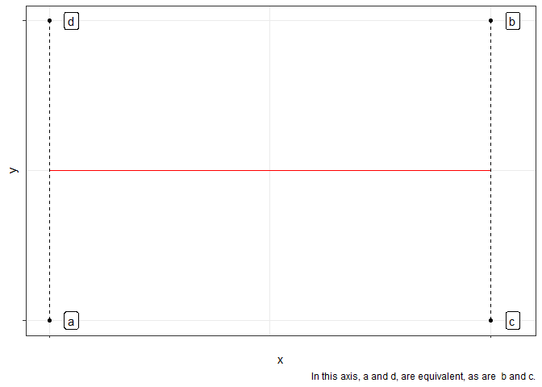
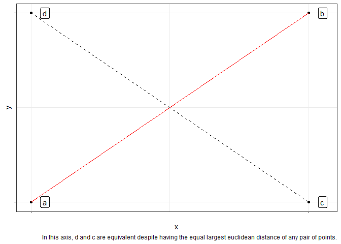

Judgement dimensionality
================

This is a space to work through ideas about making judgements about
objects across varying levels of dimensional representation.

At its core is the halfbaked idea that differences in judgements may in
part be informed by the complexity of the space within which the
judgement is being made. For example:

  - Organic food is good and non-organic food is bad, is a simple
    representation of a higher dimensional problem optimising issues of
    health, labour, environmental sustainability, etc.

  - Political parties are “progressive” or “conservative” is a low
    dimensional reduction of their status in dimensions like “economic”,
    “authoritarian”, “social” (appreciating that these themselves are
    abstractions of far more granular constructs)

In making judgements in these spaces, actors may vary in (1) the degree
to which they reduce the dimensionality of the judgement space and also
(2) in how they posit the axes of judgement.

Figures below represent the projected reduction of the same 4 objects
scattered in 2 dimensions onto two different axes of judgement (2).

``` r
library(tidyverse)

df <-  tibble(obs = letters[1:4], 
              x = c(1,2,2,1), 
              y = rep(1:2, 2), 
              flat = rep(1.5, 4),
              pos = c(1, 2, 2, 1), 
              posx = c(1,2,1.5, 1.5),
              posy = posx)

p <-  ggplot(df, aes(x,y)) + 
  geom_point() + 
  geom_label(aes(label = obs), nudge_x = .05) +
  theme_bw() + 
  scale_x_continuous(breaks = 1:2, labels = c("", "")) +
  scale_y_continuous(breaks = 1:2, labels = c("", ""))

p + geom_line(aes(y = flat), colour = "red") + 
  geom_linerange(aes(ymin = y, ymax = flat), linetype = "dashed") + labs(caption = "In this axis, a and d, are equivalent, as are  b and c.")
```

<!-- -->

``` r
p + geom_line(aes(y = pos), colour = "red") + 
  geom_segment(aes(y = y, yend = posy, x=x, xend = posx), linetype = "dashed") + labs(caption = "In this axis, d and c are equivalent despite having the equal largest euclidean distance of any pair of points.")
```

<!-- -->

A stupidly late realisation is that this can be represented by the
variation in weights of the underlying dimensions on the dimension of
judgement. For the two scenarios presented above.

``` r
library(igraph)

g1 <- graph.formula("x" -+ "judgement",
                    "y" -+ "judgement",
                      simplify = TRUE)
E(g1)$label <- c(1, 0) 
g1$layout <- layout_in_circle(g1)

plot(g1, size = 90)
```

<!-- -->

``` r
g2 <- graph.formula("x" -+ "judgement",
                    "y" -+ "judgement",
                      simplify = TRUE)
E(g2)$label <- c(1, 1) 
g2$layout <- layout_in_circle(g2)
plot(g2, size = 90)
```

<!-- -->
